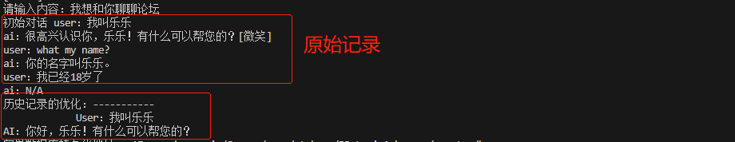

# Agent功能模块实现

目前在这个部分分为了4个模块进行使用
## langchain_agent目录
此目录包含项目的所有核心代码文件

- `main.py`：main部分，主要用于测试代码运行
- `langchain_api.py`：接口的提供，目的是提供更容易使用的接口
- `characters.json`:保存角色资料（个人信息，对话历史记录）的文件
-- `langchain_agent\imports.py`：所有的模块引用
-- `langchain_agent\function.py`：Agent主要的方法类，
其中包括了任务类MyTask，
PDF数据向量化KnownLedge2Vector，
json记忆库保存部分json_Memory_Create，
redis数据库创建Redis_Create，
Agent代理类Vect_Agent，以及暂未实现的对话代理类DialogueAgent
-- `langchain_agent\prompt_set.py`：prompt设置以及优化类的部分，主要是为了对历史记录进行优化，并提供了一个对话划分的办法类Split_out。
-- `langchain_agent\usefulmethod.py`：主要是提供大语言模型类，可以获取langchain的大语言模型。
-- `langchain_agent\json_save.py`：实现保存AI角色资料，用户交互历史记录

## AI-NPC Agent的整个运行的逻辑

1、首先是要读取history内的内容，然后进行历史记录的优化

2、然后将优化的历史记录覆盖掉原本的内容(然后写入输入，输出)

3、其中Agent部分的使用逻辑如下
由于使用的Agent是使用多个Tools，实际上就是按照tool的顺序来使用，实际上是Ai根据tool中的具体描述来使用工具，如果当前的语境下所有的描述都符合，那么就会按照顺序来使用工具。

4、未来优化

