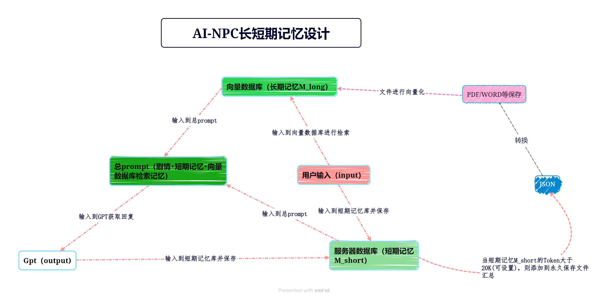

# 向量数据库设计构思图


# MYSQL 数据库 （ubunt）配置

1、更新包管理器索引:打开终端并运行以下命令以更新包管理器的索引：

``` bash
sudo apt update
```
2、安装 MySQL 服务器:使用以下命令安装 MySQL 服务器
``` bash
sudo apt install mysql-server

```

3、安全配置:
MySQL 自带一个安全脚本，可以用来设置密码策略等。运行以下命令并按照提示操作：
``` bash
sudo mysql_secure_installation

```

这个脚本会提示你设置 root 用户的密码、删除匿名用户、禁止 root 用户远程登录、删除测试数据库并重新加载权限表。

4、登录 MySQL:
安装完成后，你可以使用以下命令登录到 MySQL 服务器：
``` bash
sudo mysql

```

5、创建新的数据库用户（可选，但推荐）:
出于安全考虑，创建一个不是 root 的新用户是一个好习惯。以下命令创建一个新用户并授权：
``` bash
CREATE USER 'your_new_user'@'localhost' IDENTIFIED BY 'your_password';
GRANT ALL PRIVILEGES ON *.* TO 'your_new_user'@'localhost' WITH GRANT OPTION;
FLUSH PRIVILEGES;
EXIT;

```
6、创建数据库:
登录到 MySQL 后，创建一个新的数据库：

``` bash

```
7、修改 MySQL 配置以允许远程访问（如果需要）:
如果你需要从其他机器访问 MySQL 服务器，需要修改配置文件。打开 /etc/mysql/mysql.conf.d/mysqld.cnf 或 /etc/mysql/my.cnf 文件：

``` bash
```

7.1、找到 bind-address 一行，并将其设置为 0.0.0.0 或者注释掉这一行
``` bash

```
7.2、保存并关闭文件，然后重启 MySQL 服务：

``` bash

```
8、打开防火墙端口（如果需要）:
如果你的服务器运行了防火墙，你可能需要打开 MySQL 的默认端口（3306）：

``` bash

```
9、测试连接:
如果你在其他机器上，可以使用以下命令测试连接到 MySQL 服务器：
``` bash

```

## 常用命令

``` bash
1、退出
EXIT;   
QUIT;

2、查看创建的数据库
``` bash
mysql -u your_username -p
sudo mysql -u root -p
SHOW DATABASES;  #显示数据库列表:

SHOW TABLES;    #显示数据库中的表:
DESCRIBE your_table_name;   #查看表结构:
SELECT * FROM your_table_name;       #查询表数据:


```
3、数据库相关信息

information_schema: 存储了数据库的元数据，包括数据库的结构和权限等信息。
mysql: 包含了用户账户信息和权限等安全相关的数据。
performance_schema: 用于收集数据库服务器性能参数，帮助监控和优化 MySQL 的性能。
sys: 提供了一组视图和函数，使得数据库管理员更容易获取性能分析和数据库诊断的信息。