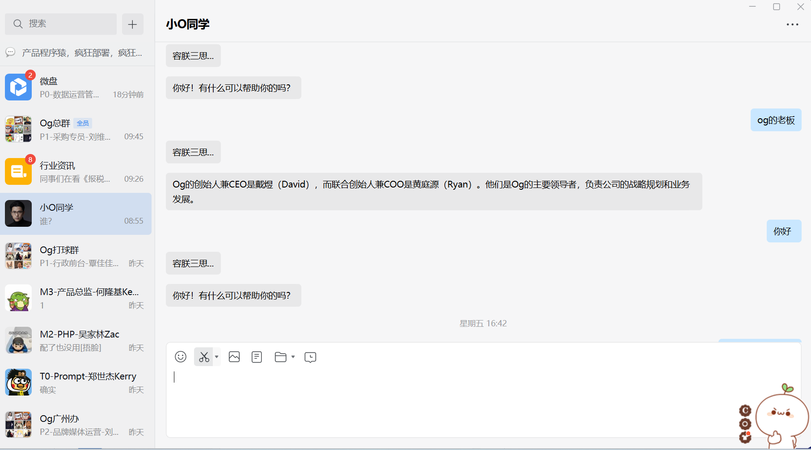

# 企微GPT-with LSTM/dify/openai




## 🌟 项目特点 

- 完成面向企业应用场景，
- 一键部署，Serverless 无服务器模式，
- 向导式安装，文档详细，安全可靠，网络延迟小,速度快
- 提供了3个 接口的方式 LSTM+本地向量文件/dify/openai


## 部署方法

<details>
    <summary>服务器部署</summary>
<br>
1. 创建企业微信应用<br>

第一步，创建应用，操作方法：企微管理员， 电脑端上的企业微信-->头像-->管理企业-->应用管理-->（最下面）创建应用-->应用logo + 填入基本信息


第二步，配置应用，操作方法：接收消息一栏-->设置API接收-->未完等待第四步。


第三步，记录和准备下列字段信息， **corpid, agentid, secret, token ,aeskey, open-api-key**

**corpid** :  电脑端上的企业微信-->头像-->管理企业-->我的企业（下方） 图略<br/><br/>
**agentid, secret**: 第一步里完成后可见。


**token ,aeskey**： 在设置API接收里（上面第二步）

**open-api-key**
这个需要在ChatGPT账号里生成，（如果没有chatgpt 账号也可以让别人生成一个，但是这个会产生费用） 


[申请网址API KEY](https://platform.openai.com/account/api-keys)


运行下面命令
```
pip install -r requirements.txt (如果不行就一个一个运行)
pip install nodejs (版本大于1.18)
npm install 

#(LSTM + 微调gpt)
nohup python /home/ubuntu/WeWork-OpenAI-Node/AI-npc-demo/Streamlis_Demos/victor_Demo/vectorflask.py & 
#(微调gpt)
nohup python /home/ubuntu/WeWork-OpenAI-Node/flaskopenaiog.py & 
nohup node app.js &
```

flask 测试
```
curl -X POST -H "Content-Type: application/json" -d '{"user_input": "What do you know about me?"}' http://localhost:5000/chat

```

## 将服务器的ip地址配置到可信IP里，至此所有配置工作完成。下面就可以直接体验了，手机或电脑上企业微信进入自己创建的应用，可以和ChatGPT的聊起来了。 

</details>


最后一步： 企业可信IP配置， 应用页的最下方，配置可信IP。 


IP地址可以是公网或者映射的域名将这个ip地址配置到可信IP里，至此所有配置工作完成。
<br/>

:100: 下面就可以直接体验了，手机或电脑上企业微信进入自己创建的应用，可以和ChatGPT的聊起来了。 


1. 将服务器IP添加到**企业可信IP**

1. 填写**接收消息服务器配置 URL**

    假设反代地址为`abc.com`，在**其后添加/message**，将地址`https://abc.com/message`填入接收消息服务器配置的URL里

</details>
